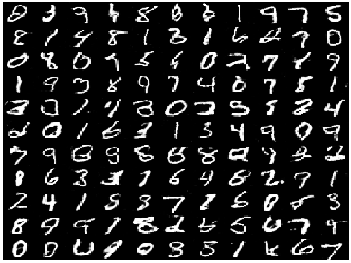
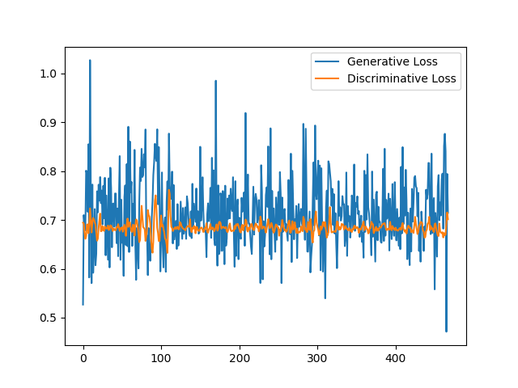
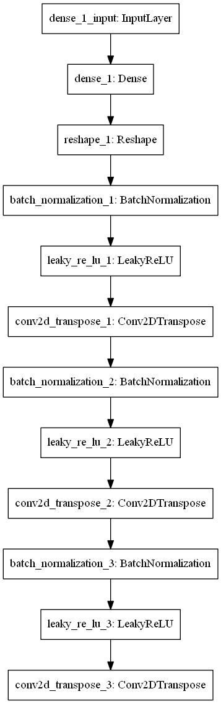
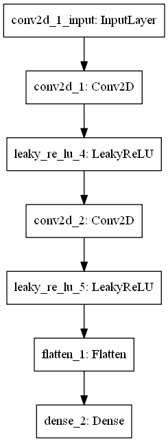
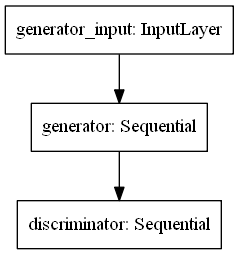

# DCGAN

DCGAN using Keras. The key is idea based on the original paper: ["UNSUPERVISED REPRESENTATION LEARNING WITH DEEP CONVOLUTIONAL GENERATIVE ADVERSARIAL NETWORKS"](https://arxiv.org/abs/1511.06434)

but architecture of this DCGAN is different.

## Dataset

MNIST

## Optimizer

Adam for both generator and discriminator.

## Demo

Generated MNIST Samples

Demo of Generative Loss and Discriminative Loss

## Architecture of Generator

## Architecture of Discriminator

## Architecture of DCGAN

