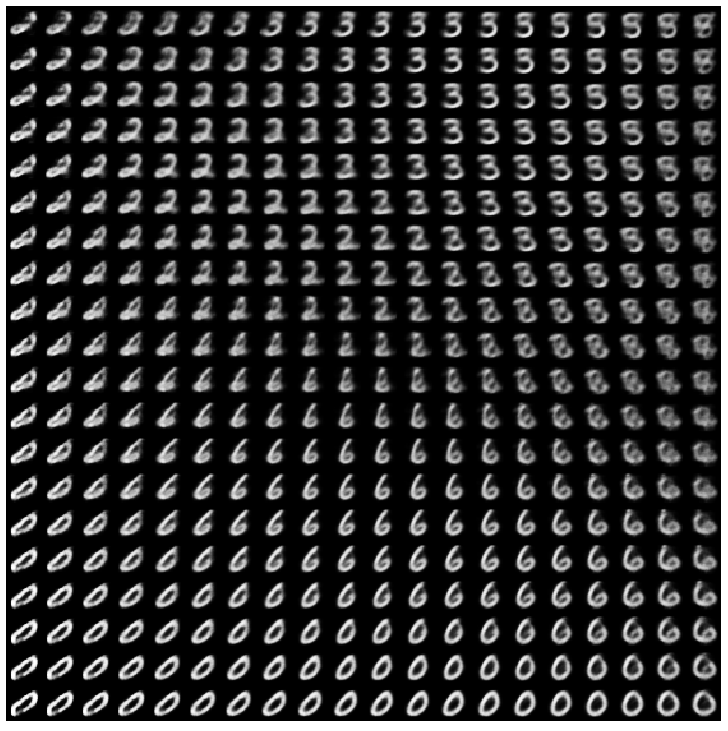
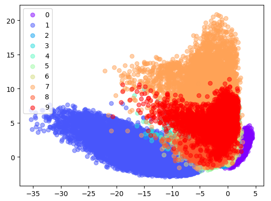
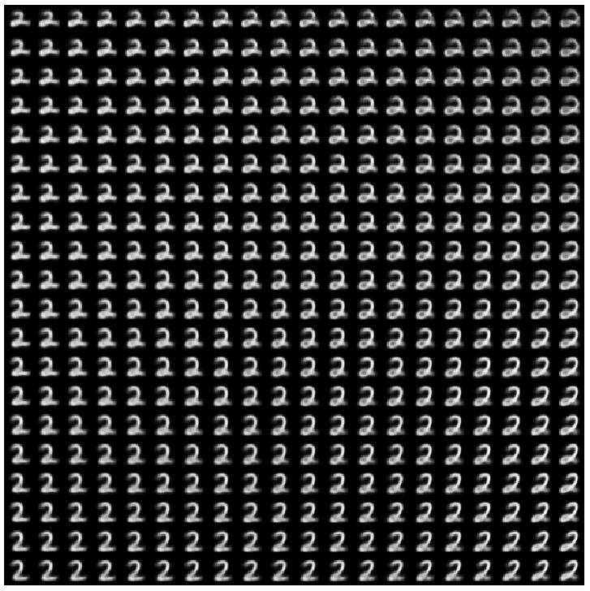
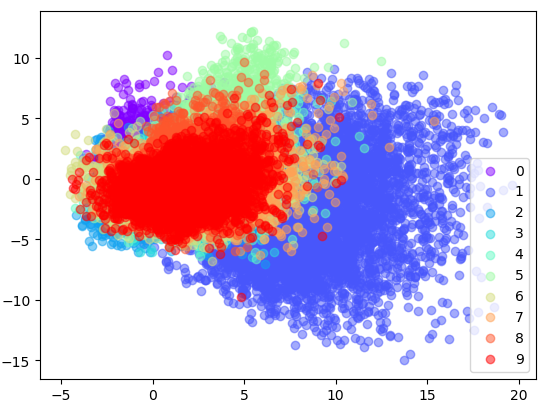

# VAE demo:VAEs Using Keras

## Dataset：MNIST

### VAE(Variational AutoEncoder) based on Keras. 

Original paper: "Auto-Encoding Variational Bayes"  https://arxiv.org/abs/1312.6114

#### VAE generated picture demo:

#### VAE generated Distribution of menas of latent z:

### VAE(Variational AutoEncoder) based on Keras. 

Original paper: "Learning Structured Output Representation using Deep Conditional Generative Models" 

papers: https://papers.nips.cc/paper/5775-learning-structured-output-representation-using-deep-conditional-generative-models.pdf

supp: https://web.eecs.umich.edu/~honglak/nips2015-condVAE_supp.pdf

#### CVAE generated picture demo:

#### CVAE generated Distribution of menas of latent z:

